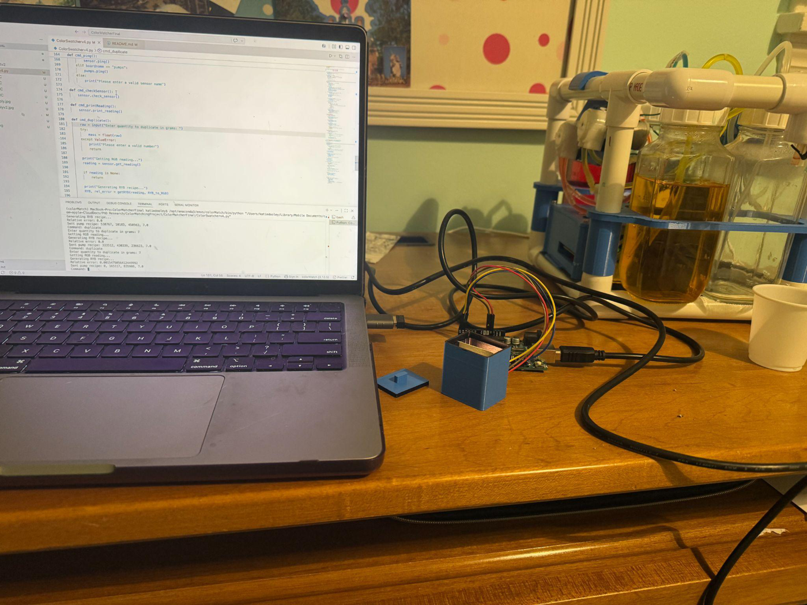
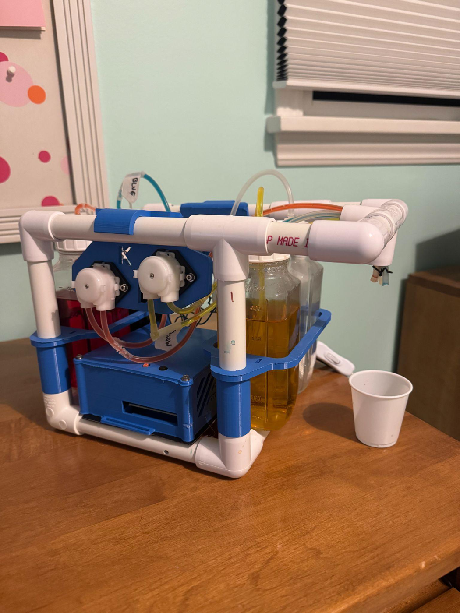
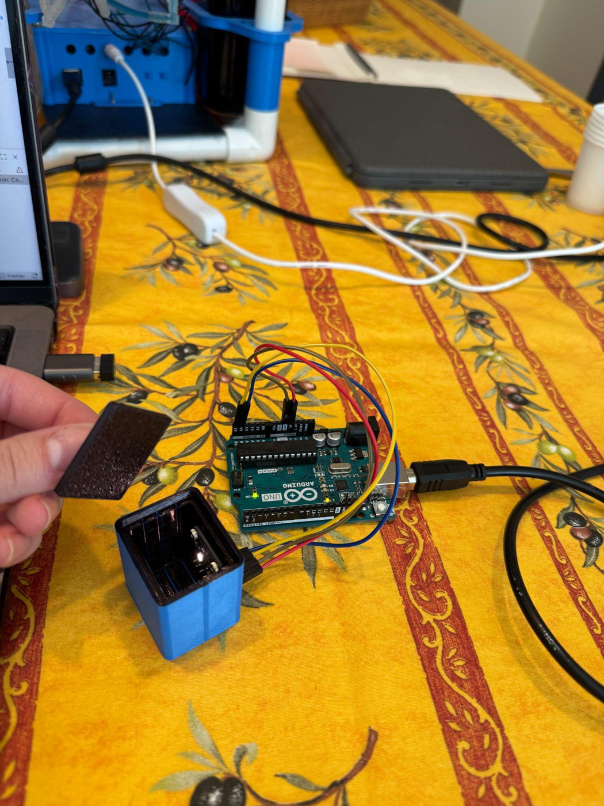
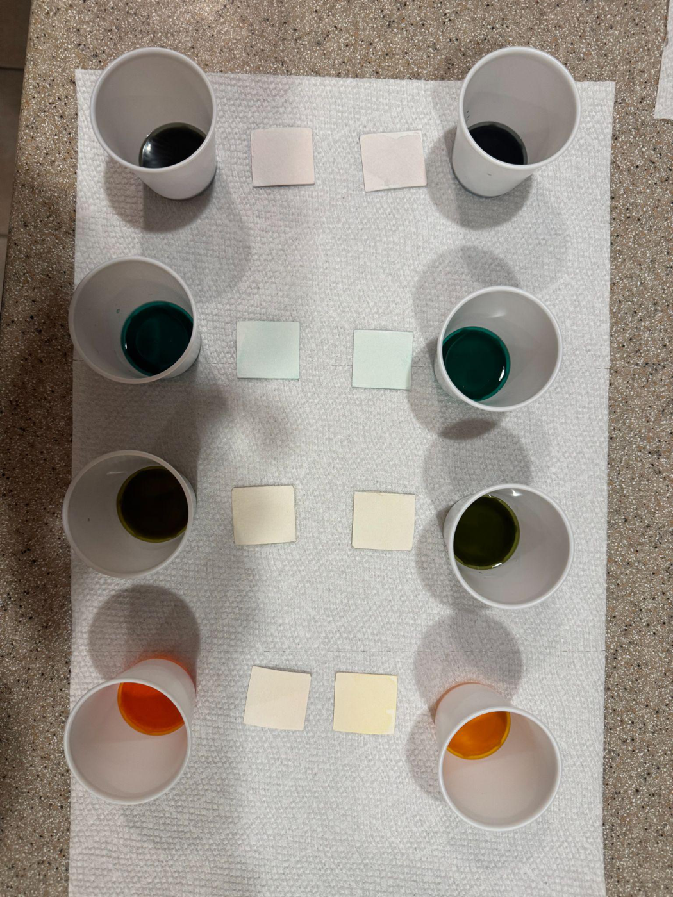

# Color Swatch Duplicator Robot

An electromechanical system that analyzes a physical color swatch and attempts to
duplicate it as closely as possible as a colored water solution, which can be
painted onto watercolor paper.



## Objective

Design a "color duplicating" robot that can analyze a color swatch and reproduce it
in liquid form, as close as possible, using the available liquid ingredients
(red, yellow, and blue dye dissolved in water).

## How it works

1. A **TCS34725 RGB color sensor**, mounted in a 3D-printed black enclosure, reads a
   dried color swatch and reports a normalized RGB value.
2. A **Python program** converts that RGB value into a Red/Yellow/Blue mixing ratio
   using a non-negative least-squares fit against a measured RYB-to-RGB matrix.
3. A **pump Arduino** drives three peristaltic pumps (via L298N motor drivers) to
   dispense the ingredients in the computed ratio, scaled to a requested total mass.

Two Arduinos (one for sensing, one for pumping) are coordinated by a single Python
command-line interface on the operator's laptop.

## Project details

- Built a liquid color-generating system using an Arduino and **L298N motor drivers**
  to control **3 peristaltic pumps**.
  - Designed and 3D-printed the structure and mountings for the liquid ingredients,
    pumps, and electrical enclosure.
- Used a **TCS34725 RGB color sensor** installed in a 3D-printed enclosure to read
  color samples.
  - The enclosure standardizes readings by fixing the position and distance of the
    sample from the sensor and containing the sample in a closed black box.
- Programmed a **Python user interface** to integrate the two Arduino setups (one for
  the pumps and one for the sensor).

### Pump assembly



### Swatch reader



## Results



The image above shows four test samples. In each pair, the **originals** (watercolor
paper dipped in dyed water) are compared against the **duplicates** generated by the
robot.

- Ran a test trying to replicate four samples using the duplicator robot.
- All four samples were created by mixing colors from the original ingredients.
- The robot performed well qualitatively, with the most noticeable discrepancy in the
  last sample (the orange).
- The duplicating algorithm is based on the **least-squares** method, so the robot
  attempts to make any color as close as possible with the available ingredients.
  - _Future tests:_ attempt to replicate colors that cannot be generated from the
    available ingredients and see how close the match is.
- The control system is **open loop** because of the nature of the samples — colors
  are applied to paper and must dry before they can be read by the sensor.
  - _Future iterations_ could analyze colors while in liquid form to enable a closed
    loop control system.

## Usage

1. Find the serial port for each board in the Arduino IDE under **Tools → Port**.
2. Edit **lines 141–142** of `ColorSwatcherv4.py` to match the serial port names for
   the pump board and sensor board.
3. Upload `ColorMixerv4/ColorMixerv4.ino` to the pump Arduino and
   `ColorSensorTestv2/ColorSensorTestv2.ino` to the sensor Arduino.
4. Run the Python interface:

   ```bash
   python3 ColorSwatcherv4.py
   ```

5. At the `Command:` prompt, use one of: `get status`, `print reading`,
   `gen recipe`, `duplicate`, `reset`, or `quit`.

To duplicate a swatch: place it in the reader, type `duplicate`, and enter the
quantity to produce in grams.

### Requirements

- Python with `numpy`, `scipy`, and `pyserial`
- Two Arduino boards (sensor + pumps), the Adafruit TCS34725 sensor, L298N motor
  drivers, and three peristaltic pumps

## Repository layout

```
Color-Swatch-Matcher/
├── ColorSwatcherv4.py            # Python host CLI
├── ColorMixerv4/ColorMixerv4.ino # Pump board firmware
├── ColorSensorTestv2/...ino      # Sensor board firmware
├── Project_Summary.pdf           # Original project overview
├── assets/                       # Photos used in this README
└── specs/                        # Project constitution (mission, tech-stack, roadmap)
```

See the [`specs/`](specs/) directory for the project mission and tech stack.

## AI Disclosure:

This project was developed with assistance from ChatGPT. ChatGPT was used during development as a programming assistant and technical reference. It was primarily used to learn unfamiliar programming concepts, troubleshoot implementation issues, and discuss possible software approaches. It was also used to learn about different color reading sensors.

The overall system design, software architecture, hardware construction, calibration methodology, testing, and final implementation decisions were completed by the author. Any AI-generated code or suggestions were reviewed, modified as needed, and incorporated only after their operation was fully understood.
